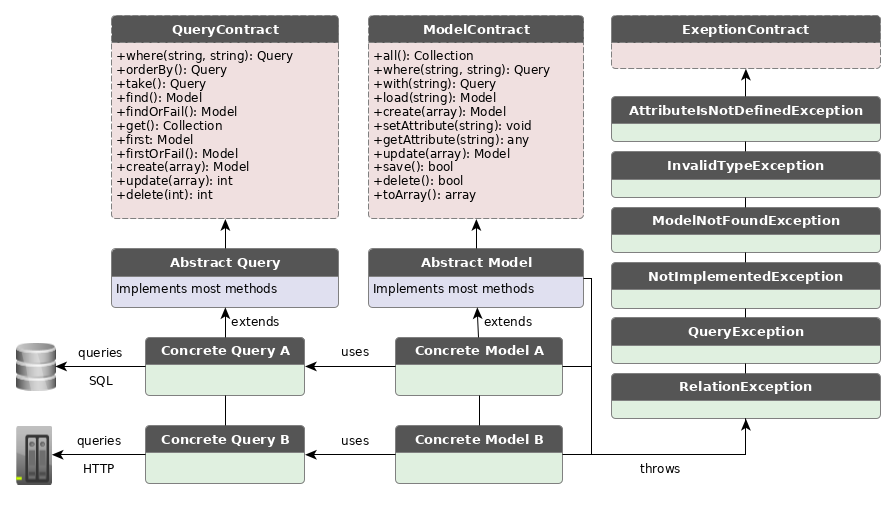

# Perform

Perform is a swiss army repository adapter. It provides functions such as _find_, _get_, _all_ for your Model. It is built for systems with a lot of integrations where data comes from different sources. The package provides two classes which both needs to be implemented in order to set up one entity; a _model class_ and a _query class_.

The library is build with Eloquent in mind. The model class mimics the Eloquent model and the query class mimics the Eloquent builder.



## WIP

The library is a work in progres.
See tests for implementation. A short example is given below:

### Example

```php

use Halpdesk\Perform\Abstracts\Model;
use Halpdesk\Perform\Contracts\Model as ModelContract;

class MyModel extends Model implements ModelContract
{
    static public $query = MyQuery::class;
    protected $fields = [
        'id',
        'field',
    ];
}

```

```php
use Halpdesk\Perform\Abstracts\Query;
use Halpdesk\Perform\Contracts\Query as QueryContract;

class EmployeeQuery extends Query implements QueryContract
{
    protected $model = MyModel::class;

    public function get()
    {
        $array = get_data_from_http_call("/uri/resource");
        foreach ($array as $row) {
            $myModels[] = new $this->model($row);
        }
        return $myModels;
    }
}

```

## Tests

Run tests with PHPUnit
