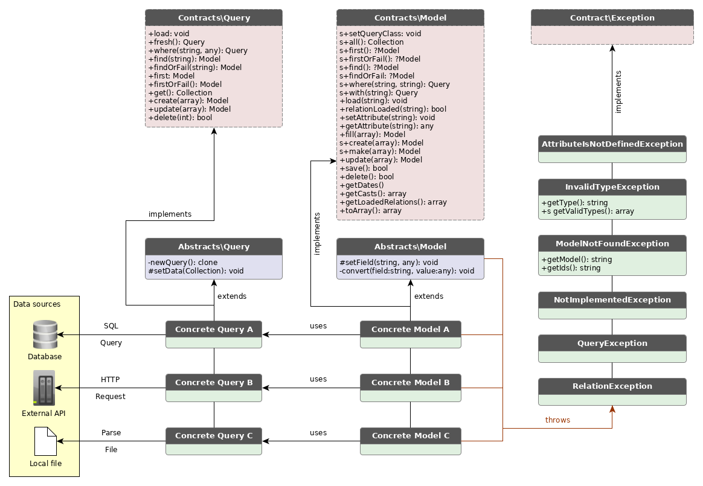

# Perform

Perform is a swiss army repository adapter. It provides functions such as _find_, _get_, _all_ for your Model. It is built for systems with a lot of integrations where data comes from different sources. The package provides two classes which both needs to be implemented in order to set up one entity; a _model class_ and a _query class_.

The library is build with Eloquent in mind. The model class mimics the Eloquent model and the query class mimics the Eloquent builder.



## WIP

The library is a work in progres.
See tests for implementation. A short example is given below:

### Example

#### Model class

```php

use Halpdesk\Perform\Abstracts\Model;
use Halpdesk\Perform\Contracts\Model as ModelContract;

class MyModel extends Model implements ModelContract
{
    static public $query = MyQuery::class;
    protected $fields = [
        'id',
        'type',
        'char',
        'word',
    ];
}

```

#### Query class

```php
use Halpdesk\Perform\Abstracts\Query;
use Halpdesk\Perform\Contracts\Query as QueryContract;

class MyQuery extends Query implements QueryContract
{
    protected $model = MyModel::class;

    public function load() : void
    {
        $data = json_file_to_array('./data.json');
        $this->setData(collect($data));
    }

    /*
     *  create(), update() and delete() must be implemented
     *  in this class in order to actually use those functions
     *
     *  it will not be covered in this simple example (yet).
     */
}

```

#### Data source (data.json)

```json
[
    { "id": 1, "type": "N", "char": "a", "word": "alpha"   }
    { "id": 2, "type": "N", "char": "b", "word": "bravo"   }
    { "id": 3, "type": "T", "char": "c", "word": "charlie" }
    { "id": 4, "type": "N", "char": "d", "word": "delta"   }
    { "id": 5, "type": "N", "char": "e", "word": "echo"    }
    { "id": 6, "type": "G", "char": "f", "word": "foxtrot" }
]
```

#### Code example

```php

    // Constructs a model with data associated with id:1 from data.json
    $alpha = MyModel::find(1);

    // Return a collection with MyModels where "type" from data.json is equal to "N"
    $ns = MyModel::where("type", "N")->get();

    // Return a full collection with MyModels constructed from data.json
    $all = MyModel::all();

    // Throws a ModelNotFoundException (since id:7 does not exist in the data loaded)
    $alpha = MyModel::findOrFail(7);
```

## Tests

Run tests with PHPUnit
