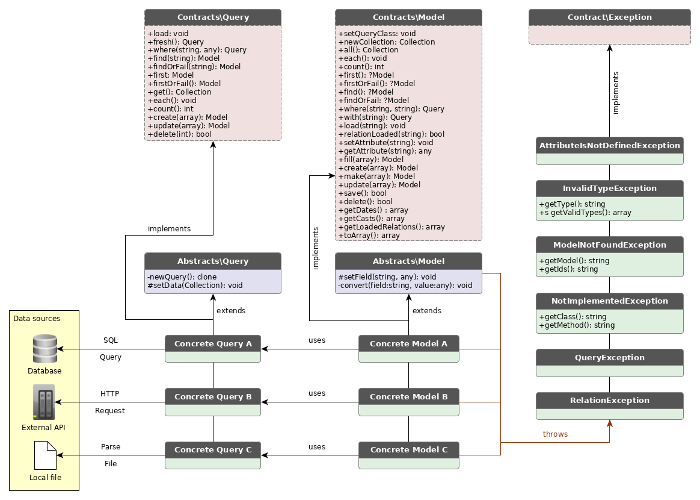

# Perform

Perform is a swiss army repository adapter. It provides functions such as _find_, _get_, _all_ for your Model. It is built for systems with a lot of integrations where data comes from different sources. The package provides two classes which both needs to be implemented in order to set up one entity; a _model class_ and a _query class_.

The library is build with Eloquent in mind. The model class mimics the Eloquent model and the query class mimics the Eloquent builder.



## WIP

The library is a work in progres.
See tests for implementation. A short example is given below:

### Example

An example with two classes, the _Person_ class and the _PersonQuery_ class.
In this example, the person data is located in a person.json.

#### Model class

```php

use Halpdesk\Perform\Abstracts\Model;
use Halpdesk\Perform\Contracts\Model as ModelContract;

class Person extends Model implements ModelContract
{
    static public $query = PersonQuery::class;

    protected $fields = [
        'id',
        'name',
        'age',
        'birthDate',
    ];

    protected $casts = [
        'name'      => 'string',
        'age'       => 'integer',
        'birthDate' => 'datetime',
    ];

    protected $dates = [
        'birthDate',
    ];

    public $dateFormat = 'Y-m-d';
}

```

#### Query class

```php
use Halpdesk\Perform\Abstracts\Query;
use Halpdesk\Perform\Contracts\Query as QueryContract;

class PersonQuery extends Query implements QueryContract
{
    protected $model = Person::class;

    public function load() : void
    {
        /*
         * Use any method to set the data: read from file, make HTTP call, query database, etc.
         * In this example, we use a json file which contains all person data
         */
        $data = json_file_to_array('./person.json');
        $this->setData(collect($data));
    }

    /*
     *  create(), update() and delete() must be implemented
     *  in this class in order to actually use those functions
     *
     *  it will not be covered in this simple example (yet).
     */
}

```

#### Data source (person.json)

```json
[
    { "id": 1, "name": "Adam", "age": 37, "birthDate": "1982-11-02" },
    { "id": 2, "name": "Billy", "age": 26, "birthDate": "1993-05-28" },
    { "id": 3, "name": "Charlie", "age": 31, "birthDate": "1988-10-05" },
    { "id": 4, "name": "David", "age": 33, "birthDate": "1986-03-14" }
    { "id": 5, "name": "Billy", "age": 22, "birthDate": "1997-02-09" }
]
```

#### Method examples

Below is a few examples of what you can do with the model class. The query class is mostly abstracted/hidden (just as the Builder class in Laravel Eloquent).

```php

    // Constructs a Person with data associated with id:1 from person.json
    $person = Person::find(1);

    // Return a collection with Persons named Billy from person.json
    $persons = Person::where("name", "Billy")->get();

    // Return a full collection with Persons constructed from person.json
    $all = Person::all();

    // Throws a ModelNotFoundException (since id:7 does not exist in the person loaded)
    $person = Person::findOrFail(7);

    // Convert the Person class to an array
    $personArray = Person::findOrFail(2)->toArray();

    // Create a new person -- this method calls the query class to attempt store the person in the data source (i.e. person.json)
    // But the create method must be implemented in the query class; if it is not, an `NotImplementedException` will be thrown
    $newPerson = Person::create([
        "name" => "Ester",
        "age" => 55,
        "birthDate" => "1964-07-02"
    ]);

    // Same as above, but creates a temporary object which is not meant to be stored in the data source
    $tempNewPerson = Person::make([
        "name" => "Ester",
        "age" => 55,
        "birthDate" => "1964-07-02"
    ]);

    // Other methods that needs to be implemented to work, or otherwise throw an `NotImplementedException`
    $person->save();
    $person->update();
    $person->delete();
```

## Tests

Run tests with PHPUnit
